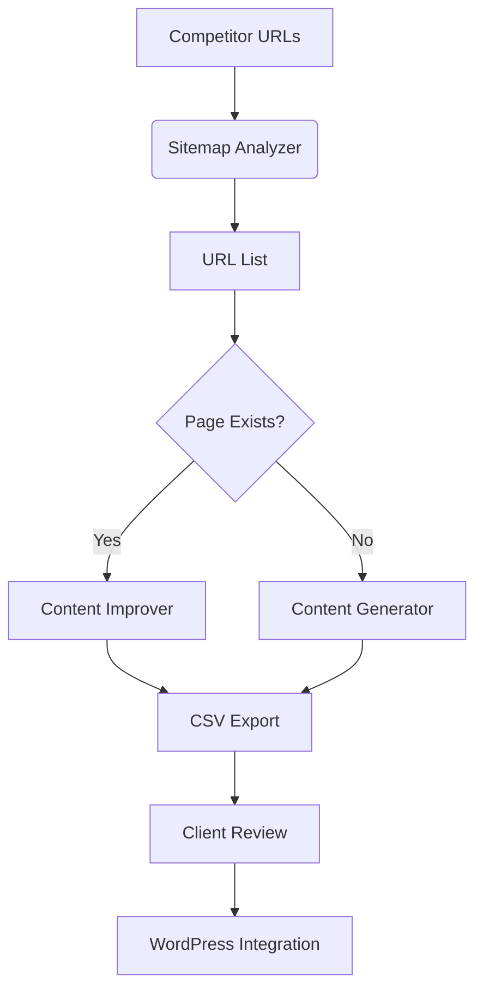

# SEO Content Generation Tool PRD

## Overview
Tool to generate and optimize location-specific service pages by analyzing competitors and leveraging AI

## Objectives
1. Create optimized content for new/existing pages
2. Analyze competitor strategies
3. Generate client-ready content drafts
4. Maintain SEO best practices

## Key Features

### Implemented Features ✅
- Competitor sitemap analysis
- Basic content generation
- CSV export for client review
- Keyword analysis from CSV
- WordPress template structure

### In Progress Features 🚧
- Web search integration
- Content gap analysis
- Multi-step AI generation
- Automated SEO scoring

### Planned Features 📅
- WordPress integration
- Client feedback loop
- Content versioning
- Automated internal linking

## Technical Architecture

## Roadmap

### Phase 1 - Core Functionality (Current)
- Competitor analysis module
- Basic content generation
- CSV reporting
- Deadline: 2024-03-15

### Phase 2 - AI Integration
- Web search analysis
- Multi-agent content generation
- Automated optimization
- Deadline: 2024-03-31

### Phase 3 - WordPress Integration
- Direct WP publishing
- Style inheritance
- Component library
- Deadline: 2024-04-15

## Risks & Mitigations

| Risk | Mitigation |
|------|------------|
| Competitor blocking | Rotating user agents/proxies |
| AI content detection | Human-in-the-loop editing |
| Template drift | Versioned templates |
| Keyword stuffing | Real-time density checks |

## Success Metrics
- 50% reduction in content creation time
- 30% improvement in SEO scores
- 25% increase in organic traffic
- 80% client approval rate

---

**Last Updated:** 2024-03-10  
**Version:** 1.2  
**Owner:** [Your Name]